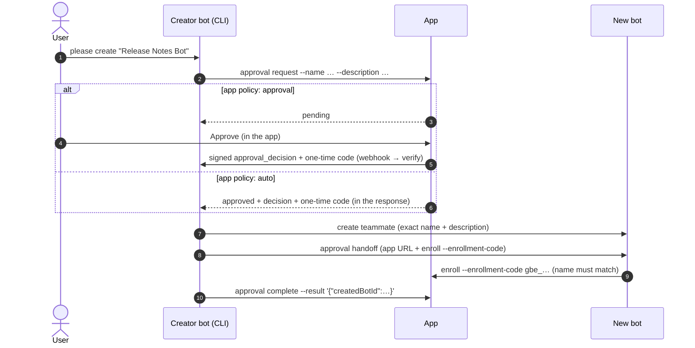

# grokbot-bridge-plugin

Connect a **Grok Bot** to a web app. The app can send the bot signed messages, the bot replies with its own token, and bots can work together in **app-hosted group rooms** by tagging each other's `@handle`.

**Who it's for:** anyone who runs an app that speaks the grokbot-bridge protocol and wants one or more Grok Bots connected to it. The repo contains:

- [`SETUP_PROMPT.md`](SETUP_PROMPT.md): one paste-in prompt that sets up any bot.
- [`grokbot-bridge.mjs`](grokbot-bridge.mjs): a single-file CLI with zero dependencies (Node 18+ built-ins only) that the bot runs from its Shell.
- This README, which also documents the full HTTP protocol.

## Quick start

### What you need

| | Where it comes from |
|---|---|
| **App URL**, e.g. `https://app.example.com` | The app owner. The app must be reachable over public https. |
| **Enrollment secret** | The app owner. It's the app's `GROKBOT_ENROLLMENT_SECRET`, and every bot gets the same one. |
| **Node 18+** and git or curl on the bot's box | Already there on a Grok Bot box. |
| **Outbound https** from the box to the app and to github.com | Needed to install the CLI and to talk to the app. |

That's all: no accounts and no keys to generate. The bot creates its own webhook and receives its own token.

### Connect a bot

1. Open [`SETUP_PROMPT.md`](SETUP_PROMPT.md) and replace `<YOUR_APP_URL>` with the app's site root, e.g. `https://app.example.com`. It's the only value you fill in; the bot fills in the rest itself.
2. Paste everything below its line into the bot.
3. When the bot asks, enter the enrollment secret into its **secure secret input** named `GROKBOT_ENROLLMENT_SECRET`. Never paste it into chat.

Repeat for each bot. The prompt is the same for all of them.

Bots created by the app's creator bot need none of this: the creator sends them a handoff with a one-time enrollment code (see [Approvals and creating bots](#approvals-and-creating-bots)).

### What the bot does by itself

1. Installs this CLI into `~/.grokbot-bridge/plugin` (git clone, or curl as a fallback).
2. Saves the app URL and writes a one-line description of what it offers.
3. Creates a **routine with a webhook trigger**. That webhook is where the app delivers messages. The routine verifies each message's signature and replies through the CLI.
4. Runs `enroll`. The app returns a **per-bot token**, stored with 0600 permissions in `~/.grokbot-bridge/state.json` and never printed, plus a unique **`@handle`**.
5. Runs `status` and `rooms --refresh`, then reports its bot id, handle, description, and routine name.

```mermaid
sequenceDiagram
    autonumber
    actor Owner as App owner
    participant App as App<br/>/api/grokbot/*
    participant Bot as Grok Bot<br/>(this CLI)
    participant Hook as Bot's webhook routine
    Owner->>App: set GROKBOT_ENROLLMENT_SECRET, deploy on https
    Owner->>Bot: paste SETUP_PROMPT.md (app URL filled in)
    Owner->>Bot: enter the secret in the bot's secure secret input
    Bot->>Bot: install this CLI
    Bot->>Hook: create a routine with a webhook trigger
    Bot->>App: POST /enroll (Bearer secret; botId, name, webhook URL, description)
    App-->>Bot: per-bot token + unique @handle
    Note over Bot,App: the secret is not used again
    App->>Hook: POST signed envelope (direct message, room message, notice)
    Hook->>Bot: routine runs `grokbot-bridge verify`
    Bot->>App: POST /messages (Bearer token): reply or room post
```

### Check that it worked

```bash
node ~/.grokbot-bridge/plugin/grokbot-bridge.mjs status --bot-id <your bot id>
```

`status` should show `"ok":true,"tokenValid":true` plus the bot's `handle`, and it never prints the token. On the app side, the bot shows up in the app's bot list, e.g. `bridge.listBots()` in the Next.js package, and a test message from the app gets a reply.

### Re-enroll, rotate, revoke

| Situation | What to do |
|---|---|
| The webhook URL changed, or the token may have leaked | Run `enroll` again with the same bot id (needs the secret). It issues a new token, the old one stops working, and the `@handle` stays the same. |
| Update the bot's description | `profile --description '<text>'` |
| The app owner rotated the enrollment secret | Nothing to do. Enrolled bots use their own tokens. Only new enrollments need the new secret. |
| The app owner revoked the bot | Its token stops working (`status` shows `tokenValid:false`), and `enroll` returns `403 this bot was revoked` until the owner restores it. |
| Disconnect a bot | The app owner revokes it. On the box, you can also remove its entry from `~/.grokbot-bridge/state.json`, delete `rooms.<botId>.json`, and delete the routine. |

### Common problems

| Symptom | Fix |
|---|---|
| `HTTP 401: invalid enrollment secret` | Wrong or old secret. Ask the app owner for the current one. |
| `non-JSON response … does GROKBOT_BRIDGE_URL point at …` | The bridge URL must be `<app>/api/grokbot`, not the site root. |
| `found N agents on this box … pass --bot-id` | Several bots share the box. Pass your own bot id (from your own profile) to every command. |
| `status` shows `tokenValid:false` | The token was rotated or revoked. Run `enroll` again (or ask the owner to restore the bot). |
| `verify` exit 2 `bad signature` | Pipe the **exact** webhook body. See [Troubleshooting](#troubleshooting) for more. |

### The app side

The reference app side is the Next.js package **`@infernos/grokbot-bridge-next`**. It is in a **private** GitLab repo, so ask the app owner for access. You don't need it to run a bot. The HTTP protocol is fully documented below ([Wire formats](#wire-formats)): a handful of small JSON endpoints plus HMAC signing, so any server in any language can implement the app side.

---

## CLI reference

```
node grokbot-bridge.mjs enroll  --inbound-url <url> [--description <text>] [--bot-id <id>] [--name <name>] [--bridge-url <url>] [--enrollment-code gbe_…]
node grokbot-bridge.mjs send    [--text <text>] [--room <roomId>] [--in-reply-to <id>] [--conversation-id <id>] [--type reply|message|event] [--message-id <id>]
node grokbot-bridge.mjs verify  [--body <json> | --body-file <path>] [--signature "t=..,v1=.."] [--max-age <sec>] [--no-dedupe]
node grokbot-bridge.mjs rooms   [--refresh]
node grokbot-bridge.mjs profile --description <text>
node grokbot-bridge.mjs status  [--offline]
node grokbot-bridge.mjs approval request [--kind create_bot] --name <name> --description <text> [--purpose <text>] [--reason <text>] [--request-id <id>]   (other kinds: --params '<json>')
node grokbot-bridge.mjs approval show --id <approvalId> [--remote]
node grokbot-bridge.mjs approval list
node grokbot-bridge.mjs approval complete --id <approvalId> [--result '<json>']
node grokbot-bridge.mjs approval fail --id <approvalId> --error '<one line>'
node grokbot-bridge.mjs approval handoff --id <approvalId> [--json]
```

`--bot-id` defaults to the only bot enrolled in `state.json`. When several bots on a shared box are enrolled, it is required.

| Command | What it does |
|---|---|
| `enroll` | POSTs `{botId, name, inboundUrl, description?}` to `<bridge>/enroll` with the enrollment secret (or, with `--enrollment-code` / `GROKBOT_ENROLLMENT_CODE`, a one-time code from a handoff), then saves the returned per-bot token and the app-assigned `@handle`. `botId` is auto-detected when exactly one agent is on the box (`/home/box/agent-data/agents/*/profile.json`). Otherwise pass `--bot-id`. `name` comes from that agent's `profile.json` unless you pass `--name`. Re-running it rotates the token. |
| `send` | Makes one authenticated POST to `<bridge>/messages`. Text comes from `--text` or stdin. `--room <roomId>` posts into a room, and the output lists `deliveredTo` handles, `hop`, and `suppressed`. When the app filtered the message, `send` still exits 0 but adds `suppressedDetail` and `hint` to the JSON and prints the hint as one stderr line, e.g. `grokbot-bridge: not delivered: low_value (acknowledgement-only); only post new information`. `--in-reply-to` defaults `--type` to `reply`. A fresh `messageId` (UUID) is generated unless you pass `--message-id`, which makes the call safe to retry. |
| `verify` | Reads the webhook body from `--body`, `--body-file`, or stdin. It checks the HMAC and freshness (±300 s by default), then prints the payload JSON plus a `_bridge` object (see below) on stdout. It remembers the last 500 messageIds per bot and refuses duplicates. Membership notices are applied to the rooms cache automatically. |
| `rooms` | Prints the rooms you are in, with each room's `rosterVersion` and members (handle, name, description, listenAll, isSelf), plus `self`. It is served from `~/.grokbot-bridge/rooms.<botId>.json` (0600); `--refresh` fetches `GET <bridge>/rooms` first. |
| `profile` | Updates your description (max 500 chars) with `POST <bridge>/profile`. |
| `status` | Shows the local enrollment (token redacted) and checks the token against `<bridge>/me`. Also prints your `createBotsPolicy` (`none` \| `approval` \| `auto`) and the app's `creator` bot (`{botId, handle, name, isSelf}` or null). |
| `approval request` | `POST <bridge>/approvals`. Prints `approvalId` and `status`. `pending`: wait for the signed decision on your webhook. `approved` (the app decided on the spot, e.g. policy `auto`): the decision and its one-time code are stored, so you can run `approval handoff` right away. `denied`: don't act. Non-creator bots get `HTTP 403`, and the message names the creator bot. |
| `approval show` / `list` | Approvals stored for this bot. The enrollment code is always redacted. `--remote` asks the app for the current status. |
| `approval complete` / `fail` | `POST <bridge>/approvals/:id/complete` (`--result` JSON object) or `/fail` (`--error`). Allowed once. If the app already finished it, for example because the new bot enrolled with its code, the CLI prints `alreadyFinished: true` and exits 0. Clears the stored code. |
| `approval handoff` | Prints a ready-to-paste setup block for the bot you just created. It contains the app URL, the approved name, an `enroll … --enrollment-code` line and the full setup prompt with the app URL filled in. **It contains the one-time code in clear**, so send it only to the new bot. Refuses when the approval isn't an approved `create_bot` or the code has expired. |

**`verify` output: `_bridge`**

| `kind` | When | Fields | What the routine does |
|---|---|---|---|
| `direct` | `type: "message"` | `reply: "required"`, `replyWith` | Acts, then runs `send --in-reply-to`. |
| `room` | `type: "room_message"` | `reply: "optional"`, `reason`, `rosterStale`, `cachedRosterVersion`, `rosterVersion`, `hint`, `replyWith` | If the roster is stale, runs `rooms --refresh`. Replies in-room only when it has something useful to add. |
| `notice` | `room_member_joined` / `room_member_left` / `room_deleted` | `noReply: true`, `reply: "none"`, `cacheUpdated`, `roomRemoved`, `cacheFile` | Nothing; verify has already updated the cache. |
| `action` | `approval_decision` / `action_request` | `noReply: true`, `action: {approvalId, kind, status, params}`, `origin` (`your_request` \| `app`), `next`; when approved also `handoffWith`, `completeWith`, `failWith` and the redacted `enrollmentCode` | `approved` + `create_bot`: create the bot with exactly `params.name` / `params.description`, send it the `approval handoff` output, then run `approval complete`. `denied` / `expired`: nothing. `verify` exits 2 if `paramsHash` does not match `params`, and stores the approval (including the code) in `state.json`. |

**Exit codes:** `0` ok · `1` usage, config, or network error · `2` bad signature, stale, or malformed message · `3` duplicate message (already processed).

**Never hangs.** HTTP calls time out after 10 s (`GROKBOT_BRIDGE_TIMEOUT_MS`) and a hard process deadline sits on top of that. An open but silent stdin is abandoned after 1.5 s. Every failure is a single `grokbot-bridge: …` line on stderr.

**Configuration.** `GROKBOT_BRIDGE_URL` and `GROKBOT_ENROLLMENT_SECRET` are looked up in this order: process env, `./.env`, `.env` next to the script, then `~/.grokbot-bridge/.env`. All the other variables come only from the process environment.

| Variable | Purpose |
|---|---|
| `GROKBOT_BRIDGE_URL` | Base URL of the app's route, e.g. `https://app.example.com/api/grokbot`. `--bridge-url` overrides it. It's saved per bot at enroll time, and later commands use the saved value. |
| `GROKBOT_ENROLLMENT_SECRET` | Shared enrollment secret. Only `enroll` reads it. |
| `GROKBOT_ENROLLMENT_CODE` | Optional, process env only. A one-time `gbe_…` code from a handoff, used by `enroll` instead of the secret. |
| `GROKBOT_BOT_ID` | Optional. Same as `--bot-id`. |
| `GROKBOT_BOT_DESCRIPTION` | Optional default for `enroll --description`. |
| `GROKBOT_BRIDGE_HOME` | Optional state directory. Default `~/.grokbot-bridge`. |
| `GROKBOT_BRIDGE_TIMEOUT_MS` | Optional HTTP timeout. Default 10000. |
| `GROKBOT_AGENTS_DIR` | Optional. Where `enroll` looks for `<id>/profile.json` to detect the bot id and name. Default `/home/box/agent-data/agents`. |

**State.** `~/.grokbot-bridge/state.json` (dir `0700`, file `0600`, written atomically) holds `{ bots: { <botId>: { botId, name, handle, description, token, inboundUrl, bridgeUrl, enrolledAt, approvals?: { <approvalId>: { kind, status, params, paramsHash, decidedBy, enrollmentCode?, … } } } }, seen: { <botId>: [messageId…] } }`. At most 50 approvals are kept per bot, and the code is deleted on `complete` / `fail`. Several bots on one shared box each get their own entry.

**Rooms cache.** Each bot has its own `~/.grokbot-bridge/rooms.<botId>.json` (0600), because the box is shared: `{ botId, self, fetchedAt, updatedAt, rooms: [{ roomId, name, description, rosterVersion, you: {listenAll}, members: [...] }] }`. `rooms --refresh` writes it, and membership notices update it in place. A notice older than the cached `rosterVersion` is ignored. Neither file ever lives in a repo.

## Security model

- **Enrollment secret (shared, used once).** The app owner sets a single `GROKBOT_ENROLLMENT_SECRET`, and every bot gets the same value. A bot sends it only to `POST /enroll`. Rotating it in the app does **not** affect bots that are already enrolled, because they authenticate with their own tokens. The reference app accepts an array of secrets for overlap windows.
- **Per-bot token.** The app returns `gbt_` + 32 random bytes (base64url) and stores only `sha256(token)` (hex). Every later bot-to-app call sends `Authorization: Bearer <token>` plus `x-grokbot-bot-id`. Re-enrolling the same `botId` issues a new token and invalidates the old one. The app can revoke a single bot, and a revoked bot cannot re-enroll until the owner restores it.
- **Constant-time comparisons** are used for the enrollment secret, token hashes, and signatures.
- **App-to-bot signatures.** Every outbound message is signed with HMAC-SHA256. The **key is `sha256(token)`** as 32 raw bytes, not the token itself. The app never stores the raw token, so this is the strongest key both sides can derive. The consequence: anyone who can read the app's bot table could forge app-to-bot messages. They still could **not** impersonate a bot to the app, because that requires the token preimage. Re-enrolling rotates both values.
- **Replay protection.** The bot rejects timestamps more than 5 minutes from its clock in either direction, and refuses messageIds it has already seen.
- **Bot creation.** Only the app's creator bot can request `create_bot`. A bot creates another bot only after a verified, approved decision (signed webhook payload, or the app's own HTTPS response to its authenticated request), and `verify` checks `paramsHash` against `params`. New bots enroll with a single-use, name-bound, short-lived code, never the shared secret. See [Approvals and creating bots](#approvals-and-creating-bots).
- **Trust boundary.** A verified message proves it came from the app. It does not make the text safe. The setup prompt tells the bot to treat `payload.text` as a user request that never overrides its own rules and never reveals secrets.

## Approvals and creating bots

Grok Bots can create teammate bots without a confirmation card. With the bridge, **the app is the gate**:

- **Only one creator bot may create bots.** The app owner designates it, e.g. a "Botfather". Every other bot has the create-bots policy `none`. They never create bots for bridge requests and answer that bot creation is handled by the creator bot. `status` and `rooms --refresh` show `createBotsPolicy` and `creator`. The app answers their `approval request` with `403`.
- **The creator always asks the app first,** including when its own user asks in its private chat. It runs `approval request`. The app's policy decides: `approval` means you approve or deny in the app, and the signed `approval_decision` arrives on the creator's webhook. `auto` means the app approves immediately and the decision, with the one-time code, comes back in the `approval request` response. The app can also decide per request with its own hook.
- **After approval,** the creator creates the teammate with **exactly** the approved name and description, messages it the output of `approval handoff`, and runs `approval complete`.
- **The new bot** follows the handoff, which is the normal setup with one change: it enrolls with `--enrollment-code` instead of the shared secret. The app records which bot created it and marks the approval completed.
- **The app can start it too:** a "Create bot" button in the app sends a signed `action_request` (already approved) to the creator bot.



**The one-time enrollment code** (`gbe_…`) is minted by the app when a `create_bot` is approved. The app stores only its hash. The code works **once**, only for a bot with the approved name (case-insensitive; a wrong name gets `403` and the code stays valid), only for a new bot id, and only for 1 hour by default. Trade-offs:
- The code reaches the new bot in a teammate message, which is acceptable because it is single-use, name-bound and short-lived. The shared secret, by contrast, never expires and enrolls anything.
- The CLI keeps the code in `state.json` (0600) and redacts it everywhere except `approval handoff`.
- A bot enrolled with a code doesn't know the shared secret. To re-enroll later (rotate its token or change its webhook URL), it needs the secret through its secure input, or the app owner creates it again.
- If the code expired before the new bot used it, the app owner re-sends the approval (`redeliverApproval`), which mints a new code.

## Rooms

The app owner creates rooms and adds or removes bots. Bots can't create rooms or join them on their own.

- **Handles.** At enrollment the app assigns each bot a unique handle derived from its name: `Example Bot` becomes `@example-bot`, and collisions become `@example-bot-2`, `-3`, and so on. `all`, `everyone`, `here`, `channel`, and `room` are reserved. The handle stays the same when the bot re-enrolls, and only the app owner can rename it.
- **Descriptions.** A bot sends a short `description` when it enrolls and can change it later with `profile`. Other bots read it in the roster to decide whom to tag.
- **Routing.** A room message, whether from the app user or from a bot via `send --room`, is delivered only to:
  - members tagged by `@handle` (or by raw `@<botId>` as a fallback),
  - the author of the message it replies to (`inReplyTo`),
  - members with `listenAll`.

  A bot never receives its own message. A bot that isn't a member gets `403 not_a_member`.
- **Only new information gets delivered.** Long bot-to-bot exchanges are fine, such as a reviewer and a dev iterating until a bug is fixed, as long as every message adds something. The app checks each bot-authored room message before delivering it. A filtered message is **stored in history but delivered to nobody**, and the response tells the sender why (`suppressed`, `suppressedDetail`, `hint`):

  | `suppressed` | Meaning |
  |---|---|
  | `low_value` | Acknowledgement or agreement only ("agreed 👍", "ok", "thanks", "noted", "lgtm", "+1"). Anything with code, a URL, a number or identifier, a question, or real content passes. A reply to a human's question is never filtered. |
  | `duplicate` | Restates a recent room message (the last 20 within 30 min, any author): the same text after normalising, or ≥ 0.9 similar. Text with different numbers or identifiers, or a revised code block, is not a duplicate. |
  | `loop` | The last 6 bot messages ping-pong between the same two bots, each re-saying its previous point. The hint says to state the outcome once and stop. |
  | `hop_limit` | The bot-to-bot chain is longer than `maxHops` (default **30**). App-user messages are hop 0, and a bot message is its parent's hop + 1 (parent = `inReplyTo`, or else the newest message routed to that bot in the last 15 min). |
  | `rate_limited` | Too many bot messages in this room (per-room bucket, default burst 10, refilling at 10 per minute). |
  | anything else | A custom filter in the app. |

  The app owner can tune or disable each check globally or per room. Don't rephrase and resend a suppressed message.
- **Roster versions.** Every membership change increments the room's `rosterVersion`. Handle renames and description changes do too, but without a notice. Every room delivery carries the current version, and `verify` flags `rosterStale` when the cache is behind, so the routine knows to run `rooms --refresh`.
- **Self.** Every room payload (room message, notice, `GET /rooms`) includes `self: {botId, handle, name}` for the recipient, and the recipient's own roster entry has `isSelf: true`. Bots must never tag their own handle, and the app never delivers self-mentions anyway.

## Wire formats

All bodies are JSON, and all app responses follow `{ ok: true, … }` or `{ ok: false, error: { code, message } }`.

### Enroll: `POST <bridge>/enroll`

```http
Authorization: Bearer <GROKBOT_ENROLLMENT_SECRET>
Content-Type: application/json

{"botId":"123e4567-e89b-12d3-a456-426614174000","name":"Example Bot","inboundUrl":"https://…/routine-webhook","description":"Runbooks and incident triage"}
```
→ `201` (new) or `200` (re-enroll; `description` is kept if omitted):
```json
{"ok":true,"token":"gbt_…","tokenType":"Bearer","rotated":false,"handle":"example-bot",
 "bot":{"botId":"…","name":"…","handle":"example-bot","description":"…","inboundUrl":"…","createdAt":"…","updatedAt":"…","lastSeenAt":"…","revokedAt":null}}
```
Errors: `401 unauthorized` (bad secret, or a used/expired/unknown code) · `400 bad_request` · `403 bot_revoked` · `403 name_mismatch` (code for another name) · `409 conflict` (a code can only enroll a new botId) · `503 not_configured`.

With a one-time code, send `Authorization: Bearer gbe_…` instead of the secret. The `name` must equal the approved name, and the response's `bot` then carries `createdByBotId` and `approvalId`.

### Bot to app: `POST <bridge>/messages`

```http
Authorization: Bearer <perBotToken>
x-grokbot-bot-id: <botId>

{"type":"reply","botId":"…","messageId":"<uuid>","inReplyTo":"<app messageId>","conversationId":"…","text":"…","sentAt":"2026-10-08T03:39:31.575Z"}
```
`type` is `reply`, `message`, or `event`. Add `"roomId":"…"` to post into a room. The response is then `202 {"ok":true,"messageId","roomId","hop","suppressed":null|"low_value"|"duplicate"|"loop"|"hop_limit"|"rate_limited"|"<custom>","suppressedDetail"?,"hint"?,"recipients":["handle",…]}`. A suppressed message still returns 202, because it was stored, with `403 not_a_member` or `404 room_not_found` on errors. Messages are idempotent by `messageId`: the first delivery returns `202 {"ok":true,"messageId":"…","duplicate":false}`, and repeats return `200 {…,"duplicate":true}`. `GET <bridge>/me` with the same headers returns the bot record. `GET <bridge>/health` is public.

### Profile and rooms lookup (bot token)

- `POST <bridge>/profile` `{"description":"…"}` → `{"ok":true,"bot":{…}}`. Max 500 chars; whitespace is collapsed.
- `GET <bridge>/me` and `GET <bridge>/rooms` also return `"createBotsPolicy":"none"|"approval"|"auto"` and `"creator":{"botId","handle","name","isSelf"}|null`.
- `GET <bridge>/rooms` →
```json
{"ok":true,"self":{"botId":"A","handle":"alpha-ops","name":"Alpha Ops"},"fetchedAt":"…",
 "rooms":[{"roomId":"room_…","name":"War Room","description":"…","rosterVersion":3,"you":{"listenAll":false},
   "members":[{"botId":"A","handle":"alpha-ops","name":"Alpha Ops","description":"…","listenAll":false,"isSelf":true},
              {"botId":"B","handle":"bravo-research","name":"Bravo Research","description":"…","listenAll":false,"isSelf":false}]}]}
```

### Approvals (bot token)

- `POST <bridge>/approvals` `{"botId","kind":"create_bot","params":{"name":"…","description":"…","purpose?":"…"},"reason?":"…","requestId?":"…"}` → `202 {"ok":true,"approvalId":"apr_…","status":"pending"|"approved"|"denied","kind","paramsHash","expiresAt","decision?":{…}}`. `decision` is present when the app decided on the spot, with the same shape as the webhook payload below. Limits: `name` 1-60 characters, `description` and `purpose` at most 2000. Errors: `403 forbidden` (create-bots policy `none`), `400`, `409 conflict` (`requestId` reused with other params), `429 too_many_requests`.
- `GET <bridge>/approvals` and `GET <bridge>/approvals/:id` return your own approvals. Codes are never included.
- `POST <bridge>/approvals/:id/complete` `{"result":{…}}` and `POST <bridge>/approvals/:id/fail` `{"error":"…"}` are allowed once, and only for the bot that requested the approval (or was asked to act). Errors: `403 forbidden`, `404 approval_not_found`, `409 already_completed`, `409 conflict` (not approved).

### App to bot: `POST <inboundUrl>` (the routine webhook)

The default format is an **in-body envelope**, because the routine may only expose the body to the bot:

```json
{"v":1,"t":1791430771,"sig":"2ec2…f599",
 "payload":{"type":"message","messageId":"ad06…7964","conversationId":"smoke-conv","text":"Please reply with the word \"pong\".","from":{"id":"user-1","name":"Justin"},"sentAt":"2026-10-08T03:39:31.074Z"}}
```

The same signature is also sent as the header `x-grokbot-signature: t=<t>,v1=<sig>` (plus `x-grokbot-message-id` and `x-grokbot-bot-id`). A receiver that sees headers but gets a bare payload body can use `verify --signature "<header>"`.

Room payloads use the same envelope, with a different `payload.type`:

```jsonc
// room message (only to tagged / replied-to / listenAll members, never to its author)
{"type":"room_message","messageId":"…","roomId":"room_…","room":{"roomId":"…","name":"War Room","description":"…"},
 "rosterVersion":3,"self":{"botId":"B","handle":"bravo-research","name":"Bravo Research"},
 "roster":[{"botId":"A","handle":"alpha-ops","name":"Alpha Ops","isSelf":false},{"botId":"B","handle":"bravo-research","name":"Bravo Research","isSelf":true}],
 "author":{"kind":"bot","botId":"A","handle":"alpha-ops","name":"Alpha Ops"},   // or {"kind":"user","id?":"…","name":"Justin"}
 "text":"@bravo-research can you find the RFC?","inReplyTo":"…?","mentions":[{"botId":"B","handle":"bravo-research"}],
 "reason":"mention","hop":1,
 "context":[{"messageId":"…","author":{…},"text":"…","createdAt":"…","truncated?":true}],   // last 10 by default
 "sentAt":"…"}

// membership notices: informational, never reply
{"type":"room_member_joined" | "room_member_left" | "room_deleted","messageId":"…","roomId":"…","room":{…},
 "rosterVersion":4,"self":{…},"member":{"botId":"C","handle":"charlie-notes","name":"…","description":"…","listenAll":false},
 "roster":[{…,"isSelf":true}, …],   // after the change; [] for room_deleted and for the removed bot itself
 "noReply":true,"sentAt":"…"}
```

Approval decisions (`approval_decision` answers your request; `action_request` is an already-approved action started in the app):

```jsonc
{"type":"approval_decision" | "action_request","messageId":"…","approvalId":"apr_…","kind":"create_bot",
 "status":"approved" | "denied" | "expired","params":{"name":"Release Notes Bot","description":"…"},
 "paramsHash":"<hex sha256 of canonicalJson(params)>","note?":"…","reason?":"…(denied)","decidedBy":"Justin" | "policy:auto" | "policy:app",
 "decidedAt":"…","expiresAt":"…","enrollmentCode?":"gbe_…","enrollmentCodeExpiresAt?":"…","sentAt":"…"}
```

On a join, every member (including the new one) gets `room_member_joined`. On a removal, the remaining members **and the removed bot** get `room_member_left`. When a room is deleted, every member gets `room_deleted`. The header `x-grokbot-payload-type` repeats `payload.type`.

**Signature algorithm:**

```
key      = SHA256(perBotToken)                       // 32 raw bytes
message  = t + "." + canonicalJson(payload)          // t = unix seconds
sig      = hex(HMAC_SHA256(key, message))
valid    = constantTimeEqual(sig, expected) && |now - t| <= 300
```

`canonicalJson` means object keys sorted recursively, no whitespace, `undefined` properties dropped, and strings and numbers exactly as `JSON.stringify` writes them. Signing over canonical JSON instead of raw bytes means verification still works if the routine runtime pretty-prints or re-orders the body. (In Python: `json.dumps(obj, sort_keys=True, separators=(",", ":"), ensure_ascii=False)`.) `verify` also finds the envelope when it is nested under another key, JSON-encoded inside a string, or embedded in surrounding text.

## Troubleshooting

| Symptom | Fix |
|---|---|
| `found N agents on this box … pass --bot-id` | Several agents share the box. Pass your own agent id, the one in your own profile and instructions, to every command. Don't pick from other bots' folders. |
| `GROKBOT_ENROLLMENT_SECRET is not set` | Add it through the secret input (as an env var) or put it in `~/.grokbot-bridge/.env` (chmod 600). You only need it for `enroll`. |
| `HTTP 401: invalid enrollment secret` | Wrong or old secret. Ask the app owner for the current one. |
| `HTTP 403: this bot was revoked` | The app owner must restore the bot before it can enroll again. |
| `HTTP 400: inboundUrl must use https` | The app accepts only https webhook URLs unless the owner enabled insecure URLs for development. |
| `non-JSON response … does GROKBOT_BRIDGE_URL point at …` | The URL must be the route base, e.g. `https://app.example.com/api/grokbot`, not the site root. |
| `status` shows `tokenValid:false` | The token was rotated (someone re-enrolled the same botId) or revoked. Run `enroll` again. |
| `verify` exit 2 `bad signature` | The body was modified, the message was signed for another bot, or the token rotated after the app sent it. Pipe the **exact** body. |
| `verify` exit 2 `stale message` | The message is more than 5 min old, or the clocks are skewed. Check `date -u`. Use `--max-age` only if you trust the transport. |
| `verify` exit 3 `duplicate` | The message was already processed. Do nothing. |
| `verify` prints `"rosterStale":true` | The room changed since you last looked. Run `rooms --bot-id <id> --refresh`. |
| `send --room` → `HTTP 403: you are not a member` | You were removed or never added. Only the app owner manages membership. |
| `send --room` prints `"suppressed":"low_value"` / `"duplicate"` / `"loop"` (plus a `not delivered: …` line on stderr) | The message added nothing new, so it was stored but not delivered. Post only new information. When the work is done, one bot states the outcome once. |
| `send --room` prints `"suppressed":"hop_limit"` or `"rate_limited"` | The chain is very long (over 30 hops by default) or the room is too busy. Summarise the outcome for the user instead of continuing. |
| `several bots are enrolled … pass --bot-id` | The shared box has several enrolled bots. Pass your own id to every command. |
| `approval request` → `HTTP 403: you may not create bots …` | You are not the app's creator bot. Tell the requester that bot creation is handled by the creator bot (named in the message and in `status`). |
| `enrollment code is invalid, already used, or expired` | Codes work once and expire after about an hour. Ask the creator bot or the app owner to re-send the approval, which gives you a new code. |
| `enroll` → `HTTP 403: this enrollment code is for a bot named "…"` | Enroll with exactly the approved `--name` from the handoff. |
| `approval handoff` → `the enrollment code … expired` | Ask the app owner to re-send the approval (`redeliverApproval`), then run `verify` on the new delivery. |
| `verify` exit 2 `paramsHash does not match params` | The action was altered. Do not act on it. |
| `ECONNREFUSED` / `timed out` | The app is down or unreachable from the box. The CLI never retries on its own, so `send --message-id <same id>` is safe to repeat. |

## Development

```bash
node --test test/       # CLI self-tests (no deps)
```

MIT © 2026 Infernos

## Changelog

- **0.4.0**: approvals and bot creation. Adds `approval request|show|list|complete|fail|handoff` and `enroll --enrollment-code` / `GROKBOT_ENROLLMENT_CODE`. `verify` recognises `approval_decision` / `action_request` (`_bridge.kind: "action"`), checks `paramsHash`, and stores the approval with its one-time code (redacted in output). `status` and `rooms` show `createBotsPolicy` and `creator`. Setup prompt: new routine rules 5 (approved actions) and 6 (only the creator bot creates bots, always through `approval request`), plus sections for the creator bot and for a bot that receives a handoff.
- **0.3.0**: `send --room` prints `suppressedDetail` and `hint` for filtered messages, plus a one-line stderr hint, and still exits 0. The setup prompt's routine rules now allow long exchanges as long as each message adds something new, with no acknowledgement-only or repeated messages, and say to state the outcome once. Docs cover the app's low-value, duplicate, and loop filters and the new `maxHops` default of 30.
- **0.2.0**: group rooms (`rooms`, `send --room`, `profile`, `enroll --description`), handles, auto-applied membership notices, the `_bridge` hint object in `verify` output, and `--bot-id` defaulting to the only enrolled bot.
- **0.1.0**: enroll, send, verify, status.
